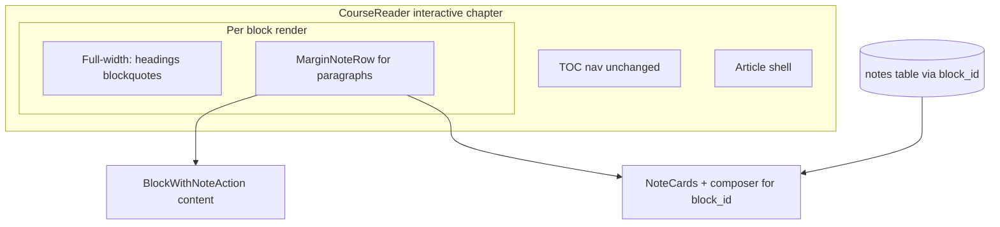

# Plan — Margin notes beside paragraphs

**Status:** Implemented (main)  
**Context:** James Odgers feedback (Apr 2025) — notes must sit **opposite** the relevant paragraph, not in a scroll-synced sidebar.  
**Related:** [ADR 0003 — Notes anchoring](../adr/0003-notes-anchoring.md) (block IDs unchanged), shipped sidebar work on `main` (`1386907`).

## Problem

Today (`CourseReader`, `FullBookReader`):

- Layout is `flex`: **article (content)** | **`<aside>` notes panel**.
- All notes render in document order in the aside; `NotesPanelContent` scrolls to approximate alignment.
- James’s DevTools mockup (`margin-top` on a card) shows the intended UX: **one horizontal band per paragraph** — text left, note card right.

This is a **layout model** change, not a tweak to aside width or scroll timing.

## Goals

1. **Desktop (md+):** For each note-capable **paragraph**, a two-column **row**: content (~62–70% width) | margin (~30–38%, cap ~28vw).
2. **Composer:** “Add note” opens the editor **in that row’s margin**, not at the top of a global list.
3. **Mobile:** Note(s) and composer **directly under** the paragraph (full width); no dependency on a separate scrollable list.
4. **Data:** Keep `block_id` anchoring, Supabase CRUD, RLS — no schema change.
5. **Calm UI:** Empty margin rows stay visually quiet; notes column still **under one-third** of typical laptop width.

## Non-goals (this plan)

- Worksheet upload / budgeting grid vs printed book (separate thread).
- Full-course markdown formatting pass (separate thread).
- Text-range / highlight anchors (ADR 0003 defers this).
- Notes on non-paragraph blocks (headings, blockquotes) unless explicitly added later.

---

## Target architecture



**Desktop row (CSS):**

```text
┌────────────────────────────────┬─────────────────────┐
│  Paragraph + note icon         │  Note card(s)       │
│  align-items: start            │  or empty gutter    │
└────────────────────────────────┴─────────────────────┘
```

Suggested Tailwind pattern:

- Row: `grid grid-cols-1 md:grid-cols-[minmax(0,1fr)_min(256px,28vw)] gap-x-4 gap-y-0 items-start`
- Full-width blocks: `md:col-span-2`

---

## Phase A — Chapter reader (`/course/[chapterId]`)

**Outcome:** Interactive chapters use margin rows; sidebar aside removed on desktop.

### A1. `MarginNoteRow` component

**New file:** `components/MarginNoteRow.tsx`

| Prop | Purpose |
|------|---------|
| `block` | Paragraph block (for `BlockWithNoteAction`) |
| `notes` | `Note[]` for this `block_id` |
| `blockIdToLabel` | Short label for card header |
| `activeBlockId` | Open composer on this row when equal |
| `hasNote` | Icon state |
| `onAddOrEditNote` | From parent |
| `onInsert` / `onUpdate` / `onDelete` | Pass through to cards |
| `onCancelComposer` | Clear `activeBlockId` |
| `isSignedIn` | Show sign-in hint in margin if false |

**Structure:**

- Outer: `data-block-row={block.block_id}` for tests.
- Left cell: existing `BlockWithNoteAction`.
- Right cell: map `notes` → extracted `NoteCard`; if `activeBlockId === block.block_id` → `NewNoteComposer` below or above cards.
- If no notes and not composing: empty margin (optional `min-h-[1px]` for row stability) — no “Notes” panel title in margin.

**Extract from `NotesPanelContent.tsx`:** Export `NoteCard` and `NewNoteComposer` (or move to `components/notes/NoteCard.tsx` etc.) so sidebar and row share UI.

### A2. Refactor `CourseReader` block loop

**File:** `components/CourseReader.tsx`

1. Build `notesByBlockId: Map<string, Note[]>` from `notes` state (same as today).
2. Replace flat `renderedBlocks` list:
   - **Heading / non-paragraph:** `BlockNode` wrapped in `md:col-span-2` (full width).
   - **Paragraph + interactive:** `<MarginNoteRow key={block.block_id} … />`.
3. Wrap all blocks in a single container: `div.space-y-0` or article inner grid — **not** sibling aside.

### A3. Remove desktop notes aside

- Delete interactive `<aside aria-label="Notes">` (lines ~382–394).
- Delete `sharedNotesContent` / `NotesPanelContent` usage for chapter view only.
- Keep static-chapter placeholder aside **or** remove and show one line in article footer (“Notes in session chapters”) — prefer **remove** aside for static; no notes anyway.

### A4. Mobile behaviour

- Same `MarginNoteRow`: `grid-cols-1` stacks margin **under** paragraph.
- **Remove** fixed “Notes” FAB + full-screen drawer for chapter reader (notes are inline).
- Optional: if `activeBlockId` set on mobile, `scrollIntoView` on `[data-block-row]` once (smooth).

### A5. State cleanup in `CourseReader`

| Remove / simplify | Reason |
|-------------------|--------|
| `scrollToBlockId` + `onScrolledToBlock` for chapter | No sidebar scroll target |
| `drawerOpen` | No drawer on chapter view |
| Double `requestAnimationFrame` after insert | Row is already adjacent |
| `NotesPanelContent` import | Replaced by `MarginNoteRow` |

Keep: `activeBlockId`, `refetch`, insert/update/delete handlers, progress upsert on note add.

### A6. Width constraints

- Outer reader: drop `max-w-[78ch]` on **outer** flex child only if article+margin together need more room; prefer **article container** `max-w-[min(100%,90rem)]` with grid inside.
- Verify at **1280×800**: margin column &lt; 426px (⅓).

**Phase A acceptance:**

- [ ] Session 1 “Reading” note appears beside that paragraph without scrolling a side panel.
- [ ] New note composer opens in the same row.
- [ ] Signed-out: note icon hidden or disabled; margin shows “Sign in to add notes” once per chapter or per row (pick one — prefer single banner in TOC).
- [ ] `pnpm lint`, `pnpm typecheck`, `pnpm build` pass.

---

## Phase B — Polish and print

### B1. Active row styling

- When `activeBlockId` matches, highlight **both** cells (`bg-[var(--slj-active)]` on row wrapper).

### B2. Empty margin UX

- No border on empty margin.
- Optional: show faint “Add note” only on `group-hover` in margin when signed in and zero notes (duplicate of paragraph icon is OK — icon stays primary).

### B3. Print

**File:** `app/globals.css`

```css
@media print {
  [data-block-row] > :last-child { display: none; } /* hide margin column */
}
```

Or class `margin-notes-column no-print`.

### B4. Accessibility

- Margin column: `aria-label="Note for this paragraph"` on card container.
- Composer: focus trap not required (single textarea); ensure tab order: content → margin.

**Phase B acceptance:**

- [ ] Print chapter hides margin notes.
- [ ] Keyboard: Enter on paragraph row still triggers add note (existing `BlockWithNoteAction`).

---

## Phase C — Full book (`/course/all`)

**Defer until Phase A signed off on one chapter.**

**Options (choose one in implementation PR):**

| Option | Pros | Cons |
|--------|------|------|
| **C1 — Same `MarginNoteRow`** in `FullBookReader` per paragraph | Consistent UX | Very long page; many DOM rows |
| **C2 — Keep sidebar** for full book only | Less churn | Inconsistent with chapter view |
| **C3 — Margin rows per chapter section** with sticky chapter headers | Balance | More layout work |

**Recommendation:** **C1** for consistency; performance acceptable for V1 (virtualization only if profiling shows jank).

**Tasks:**

1. Mirror `CourseReader` block loop in `FullBookReader` `renderedChapters`.
2. Remove full-book notes aside + mobile drawer (same as Phase A).
3. Reuse `notesByBlockId` across all chapters’ `blockIds`.

**Phase C acceptance:**

- [ ] `/course/all#09-session-one` — one `h1`, note beside paragraph in Session One section.

---

## Phase D — Tests and docs

### D1. Unit / component tests (optional but useful)

- `MarginNoteRow`: renders composer when `activeBlockId` matches; renders N cards for N notes.

### D2. E2E updates

**File:** `e2e/james-feedback-visual.spec.ts`

| Test | Change |
|------|--------|
| Notes width | Measure `[data-block-row]` margin cell, not `aside[aria-label="Notes"]` |
| New | Note card is descendant of same `[data-block-row]` as paragraph |
| Remove | Tests that assume global aside visible on desktop |

### D3. Docs

- Update [ADR 0003](../adr/0003-notes-anchoring.md) addendum: “Presentation: margin row per paragraph (2025).”
- [ ] Checkbox in [Tasks.md](../Tasks.md) when complete.
- [AGENTS.md](../AGENTS.md): note margin layout in reader description.

**Phase D acceptance:**

- [ ] `pnpm test:e2e` passes with `NEXT_PUBLIC_PLAYWRIGHT_E2E=1`.

---

## File checklist

| Action | Path |
|--------|------|
| Create | `components/MarginNoteRow.tsx` |
| Refactor | `components/NotesPanelContent.tsx` (extract shared cards) |
| Refactor | `components/CourseReader.tsx` |
| Refactor | `components/FullBookReader.tsx` (Phase C) |
| Minor | `components/BlockContent.tsx` (only if row wrapper moves note icon) |
| Update | `e2e/james-feedback-visual.spec.ts` |
| Update | `app/globals.css` (print) |
| Update | `docs/adr/0003-notes-anchoring.md`, `docs/Tasks.md` |

---

## Risks and mitigations

| Risk | Mitigation |
|------|------------|
| Row misalignment on tall blockquotes adjacent to short notes | Only paragraphs get rows; blockquotes full-width |
| Very long note body stretches row | `max-h` + scroll in card, or `overflow-y-auto` on margin cell |
| Full book DOM size | Phase C after A; profile if needed |
| Regression on progress / last-read | Keep `upsertProgress` in insert handler unchanged |

---

## Definition of done (whole plan)

1. James can add a note on a mid-chapter paragraph and see it **beside** that text on laptop without using a notes panel scroll.
2. Mobile shows the note under the paragraph.
3. No `NEXT_PUBLIC_PLAYWRIGHT_E2E` changes required for production.
4. Lint, typecheck, build, e2e green.
5. Louis / James sign-off on Session 1 + Introduction chapter spot-check.

---

## Suggested PR order

1. **PR 1 (Phase A + B):** `MarginNoteRow`, `CourseReader` only, print CSS.  
2. **PR 2 (Phase C + D):** `FullBookReader`, e2e, docs.

Do not merge Phase C before Phase A is reviewed in browser on production preview.
